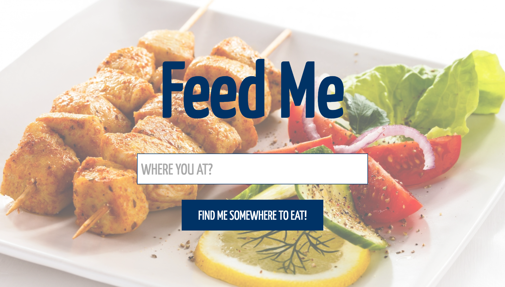
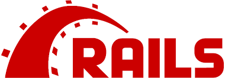
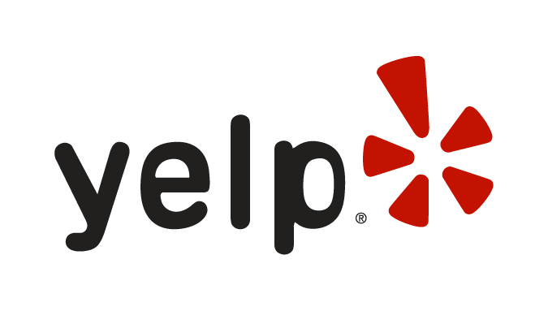

# FeedMe - FE (Front End)

*** This is the Ruby on Rails Backend End. For the Angular User Interface, Please visit [FeedMe - FE (Front End)](https://github.com/MichaelZLai/FeedMe-FE) ***

Feeling Hungry?

Feed Me helps out of town and local patrons discover new restaurants in any area. Just enter a location and press "Find Me Somewhere to Eat!". Restaurant details are reinforced by Yelp.



## Installation

*** Please note: You need to have [FeedMe - FE (Front End)](https://github.com/MichaelZLai/FeedMe-FE) cloned and running before FeedMe is rendered. ***

```
git clone git@github.com:MichaelZLai/FeedMe-BE.git
gem install
rails s
```

## User Stories

**MVP**
- [x] Allow to restaurant search for relative location (city, zip, state, neighborhood)
- [x] Render a map with a random restaurant marker location
- [x] Able to say Yes or No to the random restaurant
- [x] If "No", populate another restaurant in the relative location

**Bronze**
- [x] Add additional specs to marker infowindows (text, user)
- [x] Allow loader to provide user with loading confirmation

**Silver**
- [x] Allow for marker pop up with restaurant details and Yelp ratings
- [ ] Have directions functionality from user inputted location to restaurant

**Gold**
- [ ] Confirmation page after a user says "Yes" with directions from location
- [ ] Able to populate Geo-Located position.
- [ ] Revolving background images

## Approach Taken

[1] A review of the student suggestions for projects was reviewed by the project team.  Two candidate projects were reviewed, an Uber and a Restaurant picker.

[2] Michael Lai was chosen to be the team's project manager. A new Slack Channel #feedme_project was created to track project status and keep import project documents.

[3] A initial design of the front-end user interface was discussed and how each of the API's would be used.

[4] It was decided that the back-end would communicate with Yelp as a proxy-api to our front-end.  The front-end would use MapBox's API directly with the array of businesses since the back-end had no need.

[5] Initial work on the Mapbox interface was done by Mark Sweet.  Michael Lai did the initial Yelp Interface API investigation. Mike Rubin did work on the front-end switching to Next restaurant views.  During the coding, several different decisions were made as to which api set of the Mapbox interface.  Initial work with Mapbox began with the leaflet subset API set. Later the decision to use the newer Mapbox api set. As the project progressed, Mark initially worked on deployment which was turned over to Mike.  Michael continued working on CSS and looked at adding additional functionality.  Mike completed project documentation and deployment instructions.  

[6]As a group, morning scrum status meetings were conducted to report on development, roadblocks, and status.  At noon a progress meeting was held to continue to refine the team's direction.  At the end of each day a review of day's status and progress.

## Technologies Used






## Authors
* **Michael Lai**
* **Mark Sweet**
* **Mike Rubin**
